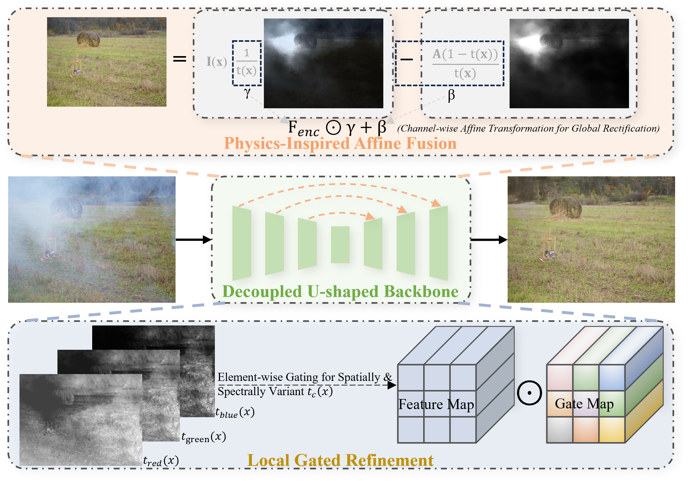
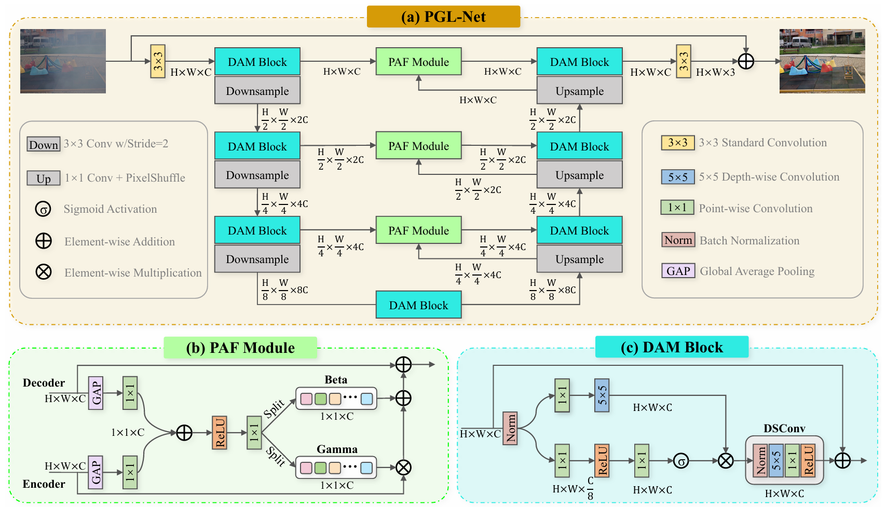
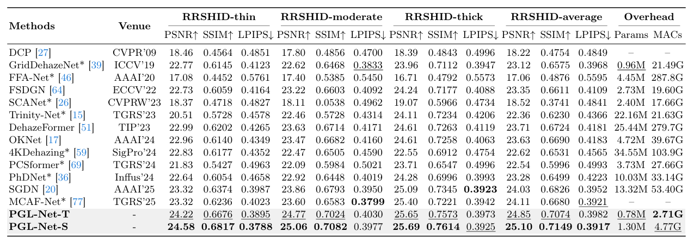
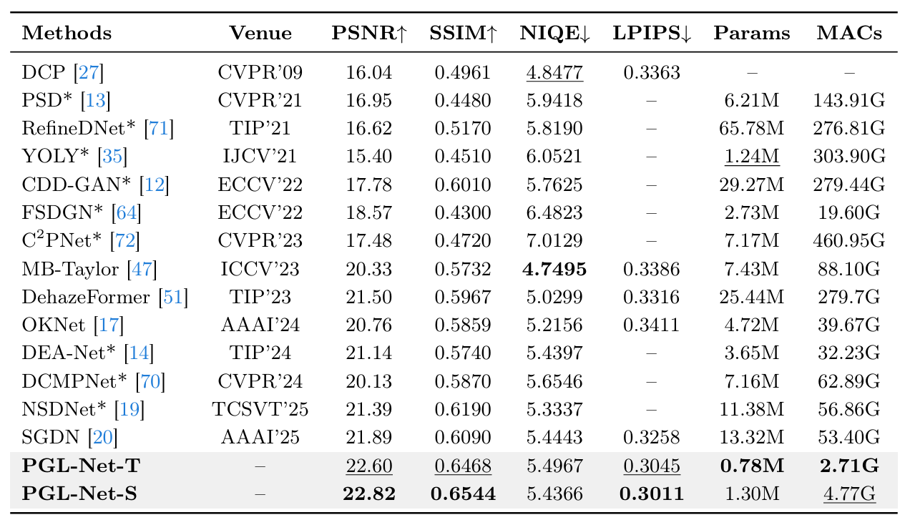
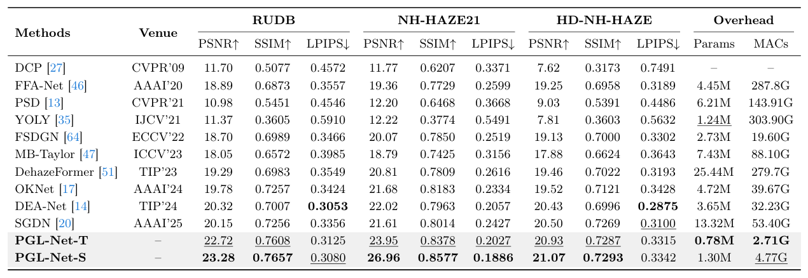
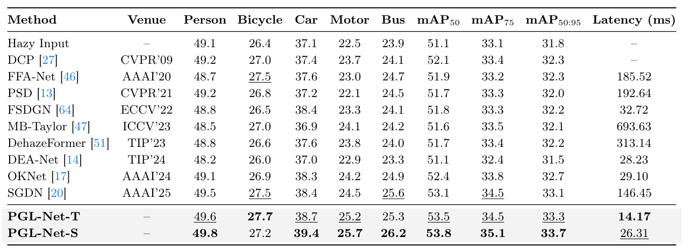
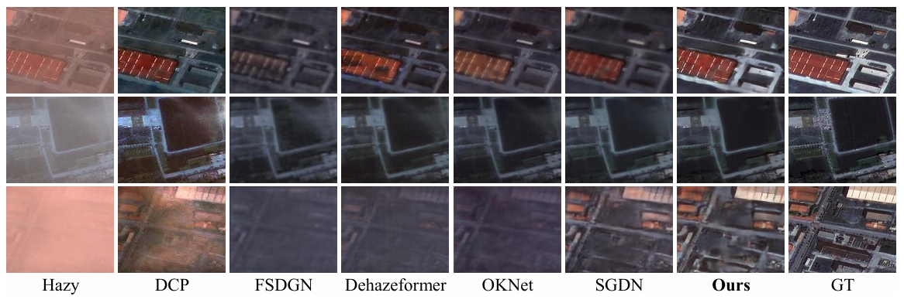
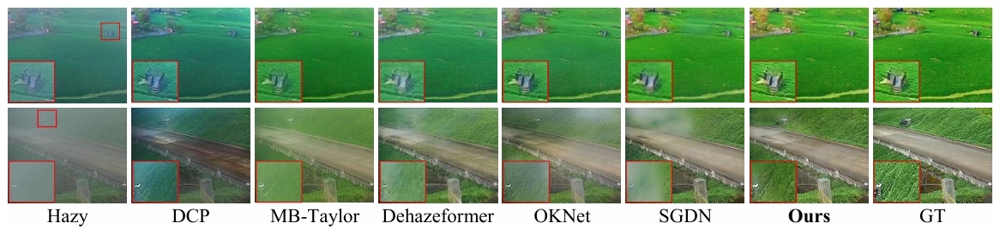
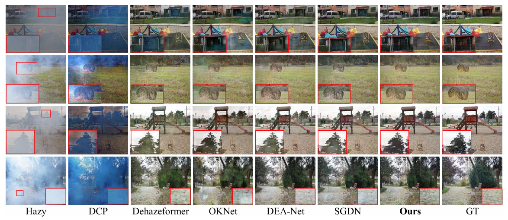

# Efficient Real-World Dehazing via Physics-Inspired Global-Local Decoupling

<p align="left">
  <a href=""></a>
  <a href=""></a>
  <a href=""></a>
</p>


> **Abstract:**
> Real-world single image dehazing is highly ill-posed due to spatially and spectrally varying scattering, while practical deployment demands lightweight and low-latency models. Existing approaches either rely on fragile physical inversion under simplified assumptions or adopt heavy blind architectures unsuitable for edge deployment. To overcome these limitations, we propose PGL-Net (Physics-Inspired Global-Local Decoupling Network), a lightweight framework that incorporates physical inductive biases via operator-level emulation, avoiding explicit parameter estimation. It decouples dehazing into global distribution rectification and local structural refinement. A Physics-Inspired Affine Fusion (PAF) module performs globally conditioned alignment across hierarchical skip connections to compensate for haze-induced bias, while a compact Degradation-Aware Modulation (DAM) block adaptively restores spatially and spectrally variant details through dynamic feature modulation. Extensive experiments on multiple real-world benchmarks demonstrate that PGL-Net achieves state-of-the-art restoration quality with significantly reduced complexity. Compared with the recent SOTA SGDN, the Tiny variant (PGL-Net-T) improves PSNR by up to 2.6 dB and consistently enhances downstream object detection accuracy, while achieving over a 10x reduction in inference latency.

## Insight

<p align="center">
  
</p>

## Architecture

<p align="center">
  
</p>

## Quantitative Results

The following paper tables are provided as images. Click each section to expand.

<details>
<summary><strong>RRSHID Results</strong> (click to expand)</summary>
<br>


<p align="center">
  
</p>

</details>

<details>
<summary><strong>RW2AH Results</strong> (click to expand)</summary>
<br>


<p align="center">
  
</p>

</details>

<details>
<summary><strong>NTIRE Results</strong> (click to expand)</summary>
<br>


<p align="center">
  
</p>

</details>

<details>
<summary><strong>RTTS Results</strong> (click to expand)</summary>
<br>


<p align="center">
  
</p>

</details>

## Subjective Results

<details>
<summary><strong>RRSHID Qualitative Results</strong> (click to expand)</summary>
<br>

<p align="center">
  
</p>

</details>

<details>
<summary><strong>RW2AH Qualitative Results</strong> (click to expand)</summary>
<br>

<p align="center">
  
</p>

</details>

<details>
<summary><strong>NTIRE Qualitative Results</strong> (click to expand)</summary>
<br>

<p align="center">
  
</p>

</details>

## Deployment

FP16 latency is measured at `512 x 512`, using [TensorRT]() on GPUs and [OpenVINO]() on CPU.

<table align="center">
  <thead>
    <tr>
      <th><nobr>Model</nobr></th>
      <th><nobr>Size (pixels)</nobr></th>
      <th><nobr>CPU OpenVINO (ms)</nobr></th>
      <th><nobr>T4 TensorRT (ms)</nobr></th>
      <th><nobr>RTX 3090 TensorRT (ms)</nobr></th>
      <th><nobr>Params (M)</nobr></th>
      <th><nobr>MACs (G)</nobr></th>
    </tr>
  </thead>
  <tbody>
    <tr>
      <td>Tiny</td>
      <td align="center">512</td>
      <td align="center">14.69</td>
      <td align="center">12.90</td>
      <td align="center">3.92</td>
      <td align="center">0.78</td>
      <td align="center">2.71</td>
    </tr>
    <tr>
      <td>Small</td>
      <td align="center">512</td>
      <td align="center">24.58</td>
      <td align="center">23.11</td>
      <td align="center">6.68</td>
      <td align="center">1.30</td>
      <td align="center">4.77</td>
    </tr>
  </tbody>
</table>


## Environment Setup

1. Create a new conda environment

```bash
conda create -n pglnet python=3.9
conda activate pglnet
```

2. Install dependencies

```bash
conda install pytorch==2.0.0 torchvision==0.15.0 torchaudio==2.0.0 pytorch-cuda=11.8 -c pytorch -c nvidia
pip install -r requirements.txt
```

## Training

```bash
torchrun --nproc_per_node=* main.py --config (config_path) --use_ddp
```

Examples:

Single-GPU training (for example, RRSHID / PGL-Net-T)

```bash
torchrun --nproc_per_node=1 main.py --config ./configs/RRSHID/pglnet_t.json --use_ddp
```

Multi-GPU training  (for example, RESIDE-IN / PGL-Net-T, 2 GPUs)

```bash
torchrun --nproc_per_node=2 main.py --config ./configs/RESIDE-IN/pglnet_t.json --use_ddp
```

Note that we use mixed precision training and distributed data parallel by default.

<details>
<summary><strong>Available configs</strong> (click to expand)</summary>
<br>

- `configs/RRSHID/pglnet_t.json`
- `configs/RRSHID/pglnet_s.json`
- `configs/RUDB/pglnet_t.json`
- `configs/RUDB/pglnet_s.json`
- `configs/RW2AH/pglnet_t.json`
- `configs/RW2AH/pglnet_s.json`
- `configs/RESIDE-IN/pglnet_t.json`
- `configs/RESIDE-IN/pglnet_s.json`
- `configs/RESIDE-OUT/pglnet_t.json`
- `configs/RESIDE-OUT/pglnet_s.json`

</details>

## Testing

```bash
python test.py --weight (weight_path) --model_type (model_type) (--tile 1024 if RUDB) --test_dir (test_dir) --gt_dir (gt_dir)
```
Examples:

Test on RRSHID (PGL-Net-T)

```bash
python test.py --weight rrshid_pglnet_t.pk --model_type pglnet_t --test_dir ./datasets/RRSHID/test/input --gt_dir ./datasets/RRSHID/test/gt
```

Test on RUDB (PGL-Net-T)

```bash
python test.py --weight rudb_pglnet_t.pk --model_type pglnet_t --test_dir ./datasets/RUDB/test/input --gt_dir ./datasets/RUDB/test/gt --tile 1024
```

## Examples

<details>
<summary><strong>We provide deployment and inference examples by backend</strong> (click to expand)</summary>
<br>

- Guide: `examples/README.md`
- TensorRT: `examples/PGLNet-TensorRT-Python/README.md`, `examples/PGLNet-TensorRT-CPP/README.md`
- OpenVINO: `examples/PGLNet-OpenVINO-Python/README.md`, `examples/PGLNet-OpenVINO-CPP/README.md`
- ONNXRuntime: `examples/PGLNet-ONNXRuntime-Python/README.md`, `examples/PGLNet-ONNXRuntime-CPP/README.md`
- OpenCV-DNN: `examples/PGLNet-OpenCV-DNN-Python/README.md`, `examples/PGLNet-OpenCV-DNN-CPP/README.md`
- MNN: `examples/PGLNet-MNN-CPP/README.md`
- Tiled Inference: `examples/PGLNet-Tiled-Inference-Python/README.md`

</details>

## Model Overhead (Params / MACs)

```bash
python ./tools/overhead.py
```

## Latency

```bash
python ./tools/latency.py --shapes 1x3x512x512
```

## Citation

```bibtex
@article{your_paper_2026,
  title   = {Efficient Real-World Dehazing via Physics-Inspired Global-Local Decoupling},
  author  = {Anonymous},
  journal = {arXiv preprint arXiv:xxxx.xxxxx},
  year    = {2026}
}
```
